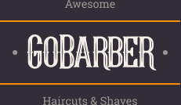

# GoBarber Web

  

 

  
  
  

## ℹ️ Sobre

Este projeto consiste em um ap pmobile desenvolvido durante o [Bootcamp GoStack](https://pages.rocketseat.com.br/gostack) da Rocketseat. A aplicação se trata de um app onde barbeiros e cabeleireiros podem se cadastrar e visualizar suas agendas completas com os horários marcados pelos clientes. E onde clientes podem se cadastrar e reservar horários com seus barbeiros e cabeleireiros preferidos.

## 💻 Tecnologias

+ [Typescript](https://www.typescriptlang.org/)
+ [React Native](https://pt-br.reactjs.org/)
+ [Styled components](https://styled-components.com/)
+ [Unform](https://github.com/Rocketseat/unform)
+ [Jest](https://jestjs.io/)
